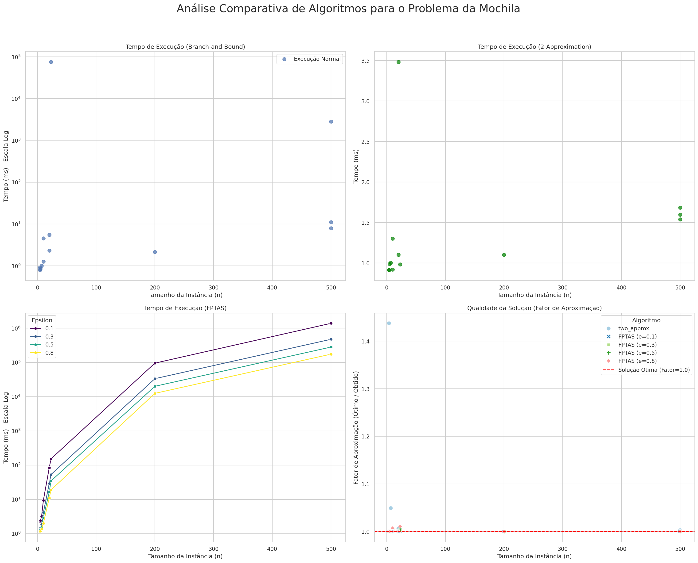
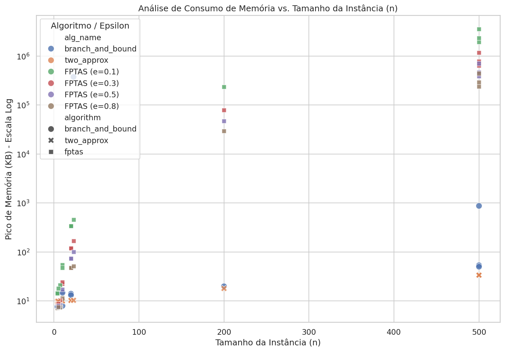

# Trabalho Prático 2: Análise de Algoritmos para o Problema da Mochila

Este projeto foi desenvolvido para a disciplina DCC207 - Algoritmos 2 da UFMG. O objetivo é implementar, executar e analisar empiricamente o desempenho de diferentes algoritmos para resolver o Problema da Mochila (Knapsack Problem), um clássico problema NP-difícil.

Foram implementadas três abordagens distintas:
-   Um algoritmo **exato** (Branch-and-Bound).
-   Um algoritmo **2-aproximativo** (heurística gulosa aprimorada).
-   Um **Esquema de Aproximação de Tempo Totalmente Polinomial (FPTAS)**.

A análise compara os algoritmos em termos de **tempo de execução**, **consumo de memória** e **qualidade da solução** em um conjunto variado de instâncias.

## Estrutura do Projeto

```
.
├── README.md
├── Analises_TP2_Alg2.ipynb
├── experiment.py
├── requirements.txt
├── data/
│   ├── large_scale/
│   └── low_dimensional/
├── results/
│   ├── dashboard_analise.png
│   ├── grafico_memoria_vs_n.png
│   └── resumo_final.csv
└── src/
    ├── __init__.py
    ├── analyze.py.py
    ├── bnb.py
    ├── fptas.py
    ├── greedy_ratio.py
    ├── two_approx.py
    └── utils/
        ├── __init__.py
        └── io.py
```

## Instalação e Configuração

Para executar este projeto, é recomendado o uso de um ambiente virtual (`venv`).

1.  **Clone o repositório:**
    ```bash
    git clone https://github.com/lucaspedras8/TP_II_ALG_II
    cd TP_II_ALG_II
    ```

2.  **Crie e ative o ambiente virtual:**
    ```bash
    # Para Linux/macOS
    python3 -m venv venv
    source venv/bin/activate

    # Para Windows
    python -m venv venv
    .\venv\Scripts\activate
    ```

3.  **Instale as dependências:**
    ```bash
    pip install -r requirements.txt
    ```

## Como Executar

A execução é dividida em duas etapas: rodar os experimentos e analisar os resultados.

**Etapa 1: Rodar os Experimentos**

Este script executa todos os algoritmos em todas as instâncias e salva os dados brutos em `results/final_results.csv`.

**Atenção:** Esta etapa pode levar várias horas para ser concluída.

```bash
python experiment.py
```

**Etapa 2: Gerar a Análise**

Após a conclusão dos experimentos, este script lê os dados brutos e gera os gráficos e a tabela de resumo em `results/`.

```bash
python src/analyze.py results/final_results.csv
```

## Análise dos Resultados

Os experimentos revelaram o trade-off clássico entre algoritmos exatos e aproximativos.

### Resumo Quantitativo

A tabela abaixo resume o desempenho médio de cada algoritmo nas instâncias testadas.

| alg_name | num_execucoes | num_timeouts | tempo_medio_ms | memoria_media_kb | fator_aprox_medio |
| :--- | :--- | :--- | :--- | :--- | :--- |
| 2-approx | 13 | 0 | 1.35 | 16.11| 1.04 |
| branch_and_bound | 13 | 0 | 5996.63 | 29037.67 | 1.00 |
| fptas (e=0.1) | 13 | 0 | 326560.04 | 619610.58 | 1.00 |
| fptas (e=0.3) | 13 | 0 | 111520.9 | 206551.95 | 1.00 |
| fptas (e=0.5) | 13 | 0 | 66189.93 | 123867.02 | 1.00 |
| fptas (e=0.8) | 13 | 0 | 41067.39 | 77374.86 | 1.00 |

### Análise Visual

**1. Desempenho (Tempo e Qualidade)**

O dashboard abaixo compara o tempo de execução e o fator de aproximação dos algoritmos. Fica claro que o Branch-and-Bound se torna inviável para instâncias maiores (timeouts), enquanto os algoritmos de aproximação terminam rapidamente. O FPTAS demonstra o claro trade-off entre tempo e precisão, controlado pelo parâmetro `ε`.



**2. Consumo de Memória**

O gráfico de memória mostra que o Branch-and-Bound e o FPTAS (com `ε` pequeno) são os algoritmos que mais consomem espaço, devido à necessidade de armazenar estados na fila de prioridades e na tabela de programação dinâmica, respectivamente.




## Algoritmos Implementados

-   **Branch-and-Bound (`bnb.py`):** Algoritmo exato que explora o espaço de busca de forma inteligente, usando uma função de limite (relaxação fracionária) e uma busca *best-first* para encontrar a solução ótima.
-   **2-Approximation (`two_approx.py`):** Algoritmo guloso aprimorado que retorna a melhor solução entre duas heurísticas: (1) o resultado da ordenação por razão valor/peso e (2) o item único de maior valor que cabe na mochila.
-   **FPTAS (`fptas.py`):** Esquema de aproximação que permite ao usuário escolher a precisão (`ε`), escalonando os valores dos itens e resolvendo a instância simplificada com programação dinâmica.

## Autores

<table>
  <tr>
    <td align="center">
      <a href="#">
        <sub>
          <b><a href="https://github.com/joao-jcc">João Correia Costa</a></b>
        </sub>
      </a>
    </td>
    <td align="center">
      <a href="#">
        <sub>
          <b><a href="https://github.com/lucaspedras8">Lucas Ferreira Pedras</a></b>
        </sub>
      </a>
    </td>
     <td align="center">
      <a href="#">
        <sub>
          <b><a href="https://github.com/LrcSantos">Lucas Rafael Costa Santos</a></b>
        </sub>
      </a>
    </td>
  </tr>
</table>